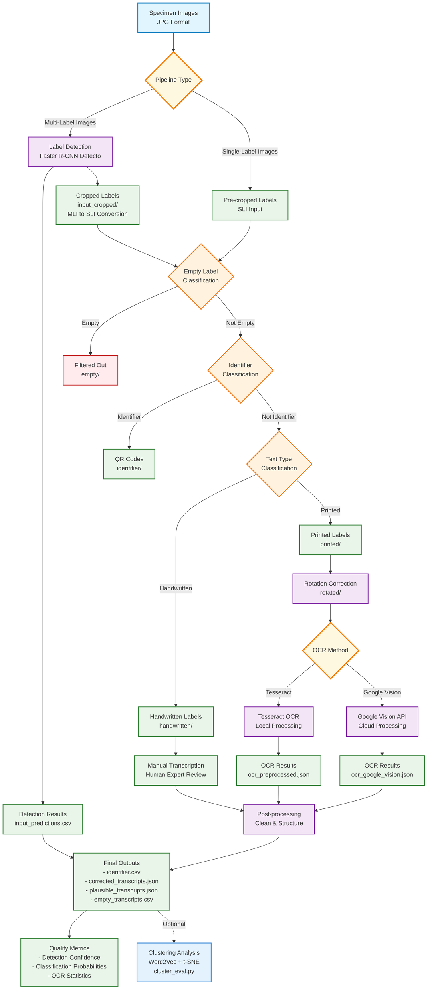

# Entomological Label Information Extraction

[](LICENSE)    [](https://entomological-label-information-extraction.readthedocs.io/en/latest/)

**AI-powered text extraction from insect specimen labels** 🦋

Extract and digitize text from museum specimen labels automatically using computer vision and OCR. Perfect for museum digitization, research data preparation, and biodiversity informatics.

> 📚 **Complete Documentation**: Visit our [comprehensive documentation](https://entomological-label-information-extraction.readthedocs.io/en/latest/) for detailed guides, API reference, and tutorials.

## Table of Contents
- [📚 Documentation](https://entomological-label-information-extraction.readthedocs.io/en/latest/) - **Complete guides & API reference**
- [Quick Start](#quick-start)
- [What This Does](#what-this-does)
- [Pipeline Workflow](#pipeline-workflow)
- [Prerequisites](#prerequisites)
- [Installation Options](#installation-options)
- [GUI Usage](#gui-usage-recommended)
- [Command Reference](#command-reference)
- [Troubleshooting](#troubleshooting)
- [File Structure](#file-structure)
- [Sample Data and Training](#sample-data-and-training)
- [Citation](#cite-this-work)
- [License](#license)

## Quick Start

**Step 0: Install Docker (if not already installed)**
```bash
# macOS: Download from https://docker.com or use Homebrew
brew install --cask docker

# Linux: Install via package manager
sudo apt install docker.io  # Ubuntu/Debian

# Windows: Download from https://docker.com
```

**Step 1: Install Project**
```bash
# Clone and setup
git clone <repository-url>
cd entomological-label-information-extraction

# Create conda environment (recommended)
conda env create -f environment.yml
conda activate entomological-label

# Install package
pip install -e .

# Directories are already created in data/
```

**Step 2: Run**
```bash
# Launch GUI (easiest method)
python launch_gui.py

# OR use Docker directly
docker-compose -f pipelines/multi-label-docker-compose.yaml up

# OR run individual scripts
python scripts/processing/detection.py -j data/MLI/input -o data/MLI/output
```

**Step 3: Results**
Check `data/MLI/output/consolidated_results.json` for extracted text and metadata.

> ✨ **Want more details?** Check our [complete documentation](https://entomological-label-information-extraction.readthedocs.io/en/latest/) for:
> - 🚀 [5-minute setup guide](https://entomological-label-information-extraction.readthedocs.io/en/latest/quickstart.html)
> - 📖 [Comprehensive user guide](https://entomological-label-information-extraction.readthedocs.io/en/latest/user_guide.html)  
> - 🔧 [API reference](https://entomological-label-information-extraction.readthedocs.io/en/latest/api/modules.html)
> - 🚑 [Troubleshooting guide](https://entomological-label-information-extraction.readthedocs.io/en/latest/troubleshooting.html)

## What This Does

- **Input**: Specimen photos (full images) or individual label images
- **Process**: AI detects labels → crops them → classifies → extracts text with OCR
- **Output**: Structured JSON/CSV files with all extracted text and metadata

### Two Pipeline Types

**Multi-Label (MLI)**: Full specimen photos with multiple labels
- Put images in `data/MLI/input/`
- System finds and crops individual labels automatically

**Single-Label (SLI)**: Pre-cropped individual label images  
- Put images in `data/SLI/input/`
- System processes each label directly

## Pipeline Workflow



## Prerequisites

### Docker Installation (Required)

Docker is required for running the processing pipelines. The GUI can automatically start Docker, but you need to install it first.

#### macOS
```bash
# Download and install Docker Desktop
# Visit: https://desktop.docker.com/mac/main/amd64/Docker.dmg (Intel)
# Visit: https://desktop.docker.com/mac/main/arm64/Docker.dmg (Apple Silicon)

# Or install via Homebrew
brew install --cask docker

# Start Docker Desktop from Applications folder
open /Applications/Docker.app
```

#### Windows
```powershell
# Download and install Docker Desktop
# Visit: https://desktop.docker.com/win/main/amd64/Docker%20Desktop%20Installer.exe

# Or install via Chocolatey
choco install docker-desktop

# Or install via winget
winget install Docker.DockerDesktop
```

#### Linux (Ubuntu/Debian)
```bash
# Update package index
sudo apt update

# Install Docker
sudo apt install docker.io docker-compose

# Start and enable Docker
sudo systemctl start docker
sudo systemctl enable docker

# Add user to docker group (optional, avoids sudo)
sudo usermod -aG docker $USER
# Logout and login again for group changes to take effect
```

#### Linux (CentOS/RHEL/Fedora)
```bash
# Install Docker
sudo dnf install docker docker-compose  # Fedora
# OR
sudo yum install docker docker-compose  # CentOS/RHEL

# Start and enable Docker
sudo systemctl start docker
sudo systemctl enable docker

# Add user to docker group (optional)
sudo usermod -aG docker $USER
```

#### Verify Docker Installation
```bash
# Check Docker is running
docker --version
docker info

# Test with hello-world
docker run hello-world
```

### System Requirements
- **Docker Desktop** (see installation above)
- **Python 3.10+** with conda
- **8GB+ RAM**, 5GB+ disk space  
- **Tesseract OCR**: `brew install tesseract` (macOS) or `sudo apt install tesseract-ocr` (Linux)

## Installation Options

### Option 1: Conda Environment (Recommended)
```bash
# Install Miniconda first: https://conda.io/miniconda.html
# Then:
conda env create -f environment.yml
conda activate entomological-label
pip install -e .
```

### Option 2: Docker (Alternative)
```bash
# Install Docker Desktop: https://docker.com
# Then run:
docker-compose -f pipelines/multi-label-docker-compose.yaml up
# OR for single-label processing:
docker-compose -f pipelines/single-label-docker-compose.yaml up
```

## GUI Usage (Recommended)

After installation, launch the graphical interface:
```bash
python launch_gui.py
```

**The GUI automatically handles Docker for you:**
- Checks if Docker is running
- Can automatically start Docker Desktop  
- Shows Docker status in the interface
- No manual Docker commands needed

The GUI provides:
- Point-and-click pipeline selection
- Automatic Docker management
- Progress monitoring
- Results browser
- Individual script execution with parameter customization

## Command Reference

### Processing Scripts Overview

The pipeline consists of several specialized scripts that work together to extract information from entomological labels:

- **detection.py**: Performs label detection on specimen photos using a Faster R-CNN model to identify and crop individual labels from multi-label specimens
- **classifiers.py**: Classifies cropped labels into multiple categories (empty, identifier, handwritten, or printed) using specialized TensorFlow models
- **rotation.py**: Detects and corrects the orientation of printed labels to optimize for OCR accuracy
- **tesseract.py**: Runs local OCR text extraction on printed labels using the Tesseract engine with preprocessing techniques
- **vision.py**: Uses the Google Vision API for cloud-based OCR, providing more accurate results on complex or challenging text
- **analysis.py**: Performs additional label analysis, such as filtering and evaluation of empty labels

### Command Examples

```bash
# Detection (finds labels in specimen photos)
python scripts/processing/detection.py -j data/MLI/input -o data/MLI/output

# Classification (sorts labels by type)
python scripts/processing/classifiers.py -m 1 -j data/SLI/input -o data/SLI/output

# Rotation correction (optimizes label orientation for OCR)
python scripts/processing/rotation.py -d data/MLI/output/input_cropped -o data/MLI/output

# Local OCR with Tesseract (extracts text from labels)
python scripts/processing/tesseract.py -d data/MLI/output/input_cropped -o data/MLI/output

# Google Vision OCR (cloud-based text extraction, requires API key)
python scripts/processing/vision.py -c credentials.json -d data/MLI/output/input_cropped -o data/MLI/output

# Label analysis (filters and evaluates empty labels)
python scripts/processing/analysis.py -d data/MLI/output/input_cropped -o data/MLI/output
```

## Troubleshooting

**"Command not found: python"**
```bash
python3 launch_gui.py
# OR activate environment: conda activate entomological-label
```

**"Docker not found" or "Docker not running"**
```bash
# Check if Docker is installed
docker --version

# Check if Docker is running
docker info

# Start Docker Desktop (macOS/Windows)
open /Applications/Docker.app  # macOS
# Or search for "Docker Desktop" and start it

# Start Docker service (Linux)
sudo systemctl start docker
```

**"No such file or directory"**
```bash
# Check that data directories exist:
ls data/MLI/input data/SLI/input
```

**"Permission denied" with Docker (Linux)**
```bash
# Add user to docker group
sudo usermod -aG docker $USER
# Logout and login again

# Or run with sudo (not recommended)
sudo docker info
```

**Model loading issues**
```bash
python scripts/processing/detection.py --clear-cache -j data/MLI/input -o data/MLI/output
```

## Advanced Installation

**Docker (alternative):**
```bash
docker-compose -f pipelines/multi-label-docker-compose.yaml up
```

**Development setup:**
```bash
pip install -e .[dev,test]
pytest unit_tests/
```

**GPU acceleration:**
- Install CUDA for NVIDIA GPUs
- Models automatically use GPU when available

## File Structure

```
Project Structure:
├── data/
│   ├── MLI/input/          # Put specimen photos here
│   ├── MLI/output/         # Results appear here
│   └── SLI/input/          # Put individual labels here
├── scripts/
│   ├── processing/         # Main processing scripts
│   ├── evaluation/         # Evaluation and analysis tools
│   └── postprocessing/     # Result consolidation
├── label_processing/       # Core processing modules
├── label_evaluation/       # Evaluation modules
├── label_postprocessing/   # Postprocessing modules
├── pipelines/              # Docker compose files
├── training_notebooks/     # Jupyter training notebooks
├── models/                 # Trained model files
├── tools/                  # Utility tools
└── unit_tests/             # Test suite

Key output files (in data/*/output/):
- consolidated_results.json  # Main results file
- identifier.csv            # Specimen IDs  
- corrected_transcripts.json # Cleaned text
```

## System Architecture

The system uses:
- **Faster R-CNN** for label detection
- **TensorFlow** models for classification (empty/printed/handwritten/identifier)
- **Tesseract OCR** and **Google Vision API** for text extraction
- **Post-processing** for data cleaning and structuring

## Sample Data and Training

**Included sample data:**
- `data/MLI/` - Multi-label specimen images (ready to test)
- `data/SLI/` - Single-label images (ready to test)

**Training datasets:** Available on Zenodo at [https://doi.org/10.7479/khac-x956](https://doi.org/10.7479/khac-x956)

**Model retraining:** See [`training_notebooks/`](training_notebooks/) for Jupyter notebooks

## Cite This Work

```bibtex
@software{anonymous2025entomological,
  title={Entomological Label Information Extraction},
  author={Anonymous},
  year={2025},
  url={[Repository URL - anonymized for review]},
  note={Training datasets available at https://doi.org/10.7479/khac-x956}
}
```

## License

MIT License - see [LICENSE](LICENSE) file

---

**Need help?** Check the GitHub issues or run `python scripts/health_check.py` for diagnostics.
