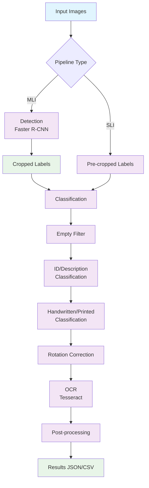

# Entomological Label Information Extraction

[](LICENSE)


[](https://entomological-label-information-extraction.readthedocs.io/en/latest/)
[](unit_tests/)

[](pipelines/Dockerfile)
[](environment.yml)


**AI-powered text extraction from insect specimen labels using computer vision and OCR**

Extract and digitize text from museum specimen labels automatically. Perfect for museum digitization, research data preparation, and biodiversity informatics.

---

## Complete Beginner? Start Here!

**5-Minute Overview:**

1. **Install** → Install conda and Tesseract (one-time setup)
2. **Get ELIE** → Download and install this software
3. **Add Images** → Put your specimen/label photos in `data/` folder
4. **Run** → Click `python launch.py` to start
5. **Results** → Get extracted text in JSON/CSV files

**System will automatically:**
- Find labels in your photos (or use pre-cropped labels)
- Classify label types
- Correct orientation
- Extract text with OCR
- Clean and organize results

**Jump to [Quick Start](#quick-start)** for step-by-step instructions

---

## What It Does

- **Input**: Specimen photos (full images) or pre-cropped label images
- **Process**: Detects labels → classifies → corrects orientation → extracts text with OCR → cleans output
- **Output**: Structured JSON/CSV files with extracted text and metadata

### Two Pipeline Types

| Pipeline | Input | Use Case |
|----------|-------|----------|
| **MLI** (Multi-Label) | Full specimen photos | System automatically detects and crops individual labels |
| **SLI** (Single-Label) | Pre-cropped labels | Processes each label image directly |

Put images in `data/MLI/input/` or `data/SLI/input/`, run pipeline, results appear in corresponding `output/` directory.

---

## Quick Start

### 1. Install Prerequisites

**Required:**

**a) Conda** - Python package manager ([Install Miniconda](https://conda.io/miniconda.html))
```bash
# Check if conda is installed:
conda --version
# If not found, install from: https://conda.io/miniconda.html
```

**b) Tesseract OCR** - Text recognition engine
```bash
# macOS:
brew install tesseract

# Linux (Ubuntu/Debian):
sudo apt install tesseract-ocr

# Windows:
# Download from: https://github.com/UB-Mannheim/tesseract/wiki

# Verify installation:
tesseract --version
```

### 2. Install ELIE

```bash
git clone <repository-url>
cd entomological-label-information-extraction

conda env create -f environment.yml
conda activate entomological-label
pip install -e .
```

### 3. Add Your Images

**For full specimen photos** (system will detect and crop labels):
```bash
# Copy your JPG images to:
cp /path/to/your/photos/*.jpg data/MLI/input/
```

**For pre-cropped label images**:
```bash
# Copy your JPG images to:
cp /path/to/your/labels/*.jpg data/SLI/input/
```

**Or use the included sample data** to test:
- Sample images already in `data/MLI/input/` and `data/SLI/input/`

### 4. Run Pipeline

**Option A: GUI (Recommended)**
```bash
python launch.py
```
Opens web interface with point-and-click pipeline selection, real-time progress, and results browser.

**Option B: Command Line**
```bash
# MLI pipeline (for full specimen photos)
./tools/pipelines/run_mli_pipeline_conda.sh

# SLI pipeline (for pre-cropped labels)
./tools/pipelines/run_sli_pipeline_conda.sh
```

### 5. View Results

Results saved to:
- `data/MLI/output/consolidated_results.json` - All extracted data
- `data/MLI/output/corrected_transcripts.json` - Cleaned text
- `data/MLI/output/identifier.csv` - Specimen IDs

**What to expect:**
- **First run**: Downloads models (~500MB), takes 5-10 minutes
- **Processing time**: 2-5 minutes per image (varies by size and CPU)
- **Progress**: GUI shows real-time progress and system metrics
- **Output**: JSON files with structured data, CSV files for spreadsheets

---

## Advanced Usage

### Individual Processing Steps

Run specific stages independently:
```bash
# Detection
python scripts/processing/detection.py -j data/MLI/input -o data/MLI/output

# Classification
python scripts/processing/classifiers.py -m 1 -j data/input -o data/output

# Rotation correction
python scripts/processing/rotation.py -i data/input -o data/output

# OCR
python scripts/processing/tesseract.py -d data/input -o data/output

# Post-processing
python scripts/postprocessing/process.py -j data/ocr_preprocessed.json -o data/output
```

### Docker (Optional)

For containerized execution:

```bash
cd pipelines

# MLI pipeline
docker-compose --profile mli up

# SLI pipeline
docker-compose --profile sli up

# Individual services
docker-compose up segmentation
docker-compose up rotation
```

See `pipelines/README.md` for complete Docker documentation.

### Apptainer/Singularity (HPC)

For high-performance computing clusters:

```bash
# Build container
cd pipelines
apptainer build elie.sif elie.def

# Run pipeline
apptainer run --bind /scratch/data:/app/data elie.sif mli

# SLURM job submission
sbatch tools/hpc/run_elie_slurm.sh
```

See `pipelines/HPC_QUICKSTART.md` for complete HPC documentation.

### Development Setup

```bash
pip install -e .[dev,test]
pytest unit_tests/
```

### GPU Acceleration

Install CUDA for NVIDIA GPUs. Models automatically use GPU when available.

### Custom OCR

Use Google Vision API instead of Tesseract:
```bash
python scripts/processing/vision.py -c credentials.json -d data/input -o data/output
```

---

## Pipeline Workflow



**Pipeline stages:**
1. **Detection** (MLI only): Detect and crop labels from specimen photos
2. **Classification**: Filter empty labels, identify QR codes, classify text type
3. **Rotation**: Correct label orientation for better OCR
4. **OCR**: Extract text using Tesseract (or Google Vision API)
5. **Post-processing**: Clean and structure extracted text
6. **Output**: Consolidated JSON with all results and metadata

---

## Project Structure

```
entomological-label-information-extraction/
├── data/
│   ├── MLI/input/                    # Full specimen photos
│   ├── MLI/output/                   # MLI results
│   ├── SLI/input/                    # Pre-cropped labels
│   └── SLI/output/                   # SLI results
├── scripts/
│   ├── processing/                   # Main pipeline scripts
│   ├── postprocessing/               # Output consolidation
│   └── evaluation/                   # Analysis tools
├── label_processing/                 # Core processing modules
├── label_postprocessing/             # Post-processing modules
├── models/                           # Trained model files
├── pipelines/
│   ├── Dockerfile                    # Docker multi-stage build
│   ├── docker-compose.yml            # Docker orchestration
│   ├── elie.def                      # Apptainer definition
│   └── requirements/                 # Per-stage dependencies
├── tools/
│   ├── pipelines/                    # Conda shell scripts
│   └── hpc/                          # SLURM job templates
├── interfaces/
│   └── launch_streamlit.py           # Web GUI
├── launch.py                         # Quick launcher
└── environment.yml                   # Conda environment
```

**Key output files:**
- `consolidated_results.json` - Main results with all metadata
- `corrected_transcripts.json` - Cleaned OCR text
- `identifier.csv` - Specimen IDs
- `input_predictions.csv` - Detection results (MLI only)

---

## Troubleshooting

### Common First-Time Issues

**"Command not found: conda"**
```bash
# Conda not installed. Install Miniconda first:
# Visit: https://conda.io/miniconda.html
# Then restart your terminal
```

**"Command not found: python"**
```bash
# Make sure conda environment is activated:
conda activate entomological-label

# Or try python3 instead:
python3 launch.py
```

**"conda: command not found" after installation**
```bash
# Restart your terminal/shell, then try again
# Or source conda:
source ~/miniconda3/bin/activate  # Adjust path if needed
```

**"No images found" or empty results**
```bash
# Check images are in correct folder:
ls data/MLI/input/  # Should show .jpg files
ls data/SLI/input/  # Should show .jpg files

# Make sure images are JPG format (not PNG, TIFF, etc.)
```

**"Tesseract not found"**
```bash
# Tesseract not installed. Install it:

# macOS:
brew install tesseract

# Linux:
sudo apt install tesseract-ocr

# Windows:
# Download installer from: https://github.com/UB-Mannheim/tesseract/wiki

# Verify it worked:
tesseract --version
```

**"No such file or directory"**
```bash
# Make sure you're in the project directory:
cd entomological-label-information-extraction
pwd  # Should end with entomological-label-information-extraction
```

**"ModuleNotFoundError" or "ImportError"**
```bash
# Environment not activated or package not installed:
conda activate entomological-label
pip install -e .
```

**"Model loading issues" or "Out of memory"**
```bash
# Clear model cache:
python scripts/processing/detection.py --clear-cache -j data/MLI/input -o data/MLI/output

# If still fails, reduce batch size or use smaller images
```

**Still stuck?**
- Check full documentation: https://entomological-label-information-extraction.readthedocs.io/
- Run diagnostic: `python scripts/health_check.py`
- Check GitHub issues for similar problems


---

## Sample Data

**Included in repository:**
- `data/MLI/` - Sample multi-label specimen images
- `data/SLI/` - Sample single-label images

**Full training datasets:**
Available on Zenodo: https://doi.org/10.7479/khac-x956

**Model retraining:**
See Jupyter notebooks in `training_notebooks/`

---

## Technical Details

### Models
- **Detection**: Faster R-CNN (Detectron2)
- **Classification**: TensorFlow CNNs for empty/printed/handwritten/identifier
- **OCR**: Tesseract + optional Google Vision API
- **Post-processing**: NLTK for text cleaning

### Preprocessing
- Stage 1 (detection/classification/rotation): Geometric normalization only
- Stage 2 (OCR): Grayscale, denoising, adaptive thresholding, deskewing
- Empty label detection: 10% border crop, dark pixel threshold < 1%

### Resource Requirements
| Stage | Memory | CPUs | Time (est.) |
|-------|--------|------|-------------|
| Detection | 6 GB | 4 | 30-60 min |
| Classification | 3 GB | 2 | 15-30 min |
| Rotation | 3 GB | 2 | 10-20 min |
| OCR | 4 GB | 3 | 30-60 min |
| Post-processing | 2 GB | 2 | 5-10 min |

*Times vary by number/size of images*

---

## Citation

```bibtex
@software{anonymous2025entomological,
  title={Entomological Label Information Extraction},
  author={Anonymous},
  year={2025},
  url={[Repository URL - anonymized for review]},
  note={Training datasets: https://doi.org/10.7479/khac-x956}
}
```

---

## License

MIT License - see [LICENSE](LICENSE) file

---

## Documentation

**Full documentation:** https://entomological-label-information-extraction.readthedocs.io/

### Quick Links
- [Quick Start Guide](https://entomological-label-information-extraction.readthedocs.io/en/latest/quickstart.html)
- [User Guide](https://entomological-label-information-extraction.readthedocs.io/en/latest/user_guide.html)
- [API Reference](https://entomological-label-information-extraction.readthedocs.io/en/latest/api/modules.html)
- [Troubleshooting](https://entomological-label-information-extraction.readthedocs.io/en/latest/troubleshooting.html)

### Additional Guides
- [Advanced Configuration](docs/ADVANCED_CONFIG.md) - Environment variables, model caching, performance tuning
- [Rotation Model Setup](docs/ROTATION_MODEL_SETUP.md) - Rotation model installation and troubleshooting
- [Docker README](pipelines/README.md) - Docker deployment details
- [HPC Quickstart](pipelines/HPC_QUICKSTART.md) - HPC/Apptainer deployment
