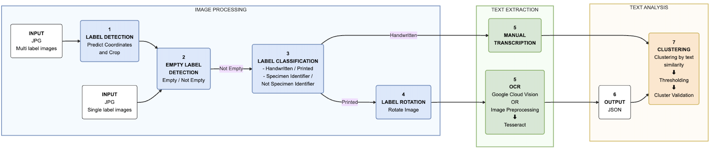

# Entomological Label Information Extraction

🐛 **AI-powered text extraction from insect specimen labels**

This package provides a modular AI framework for the semi-automated processing of entomological specimen labels using deep learning models.

## Pipeline Workflow



**Process Flow:**

1. **🔍 Label Detection** → Automatically locate labels in specimen images
2. **🏷️ Image Classification** → Categorize labels by type (handwritten, printed, etc.)
3. **🔄 Rotation Correction** → Align text for optimal OCR performance  
4. **📝 Text Extraction** → Convert images to text using OCR technologies
5. **⚙️ Post-processing** → Clean and structure extracted information

## Documentation

📖 **[USER_GUIDE.md](USER_GUIDE.md)** - Complete usage instructions with examples
   - Quick start with sample data
   - Docker pipeline instructions
   - Command-line options and examples
   - Real-world workflows

🔧 **[TECHNICAL_GUIDE.md](TECHNICAL_GUIDE.md)** - Installation, setup, and troubleshooting
   - System requirements and installation
   - Docker setup
   - GPU configuration
   - Development environment
   - API reference

📚 **Additional Documentation:**
   - `training_notebooks/` - Jupyter notebooks for model retraining
   - `docs/` - Technical documentation and examples
   - `unit_tests/` - Test suite and usage examples

## Repository Structure

- `scripts/processing/` - Main processing scripts
- `label_processing/` - Core Python package
- `data/MLI/` - Multi-label specimen images (sample data)
- `data/SLI/` - Single-label images (sample data)
- `models/` - Pre-trained AI models
- `training_notebooks/` - Model training and customization
- `unit_tests/` - Test suite

## Quick Start

**New users**: Start with [USER_GUIDE.md](USER_GUIDE.md) for complete instructions

**Quick Docker setup** (recommended):

```bash
# Clone and run with sample data
git clone https://github.com/[username]/entomological-label-information-extraction.git
cd entomological-label-information-extraction
docker compose -f multi-label-docker-compose.yaml up --build
```

**Installation issues**: See [TECHNICAL_GUIDE.md](TECHNICAL_GUIDE.md)

## Datasets

The training and testing datasets used for models development are publicly available on Zenodo:

[https://doi.org/10.7479/khac-x956](https://doi.org/10.7479/khac-x956)

**Sample data included:**
- `data/MLI/` - Multi-label specimen images (ready to use)
- `data/SLI/` - Single-label images (ready to use)

## License

MIT License - see LICENSE file for details
