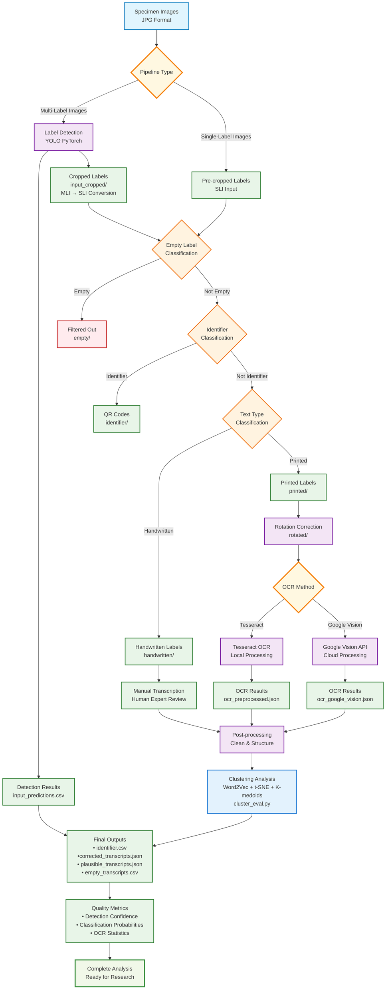

# Entomological Label Information Extraction

**AI-powered text extraction from insect specimen labels**

This package automatically extracts and digitizes text information from entomological (insect) specimen labels using artificial intelligence.

## Table of Contents
- [Entomological Label Information Extraction](#entomological-label-information-extraction)
  - [Table of Contents](#table-of-contents)
  - [What This Tool Does](#what-this-tool-does)
  - [Pipeline Workflow](#pipeline-workflow)
    - [**Pipeline Overview**](#pipeline-overview)
    - [**Key Outputs**](#key-outputs)
  - [Documentation](#documentation)
  - [Repository Structure](#repository-structure)
  - [Testing \& Compatibility](#testing--compatibility)
  - [Datasets](#datasets)
  - [License](#license)

## What This Tool Does

**The Problem:** Museums and researchers have millions of insect specimens with handwritten and printed labels that contain valuable scientific data, but manually transcribing this information is extremely time-consuming.

**The Solution:** This AI system automatically:
- **Finds labels** in specimen photos
- **Reads the text** using computer vision
- **Organizes the data** into spreadsheets
- **Processes thousands** of specimens quickly

**Real-World Impact:**
- **Time Savings:** Process 1000s of specimens in hours
- **High Accuracy:** AI models trained specifically on entomological data
- **Scalable:** Works for museum collections of any size
- **Reproducible:** Consistent results across different users and institutions
- **Performance Optimized:** 50-90% faster processing with automatic caching and GPU acceleration

## Pipeline Workflow



### **Pipeline Overview**

The visual flowchart above shows the complete processing workflow. For detailed technical information about each module, see [TECHNICAL_GUIDE.md](TECHNICAL_GUIDE.md).

**Key Processing Steps:**
1. **Label Detection** - Finds labels in specimen photos (PyTorch YOLO)
2. **Classification Pipeline** - Filters empty labels, identifies specimen IDs, sorts by text type (TensorFlow CNN)
3. **Text Processing** - Rotation correction + OCR extraction (Tesseract/Google Vision)
4. **Post-processing** - Structured data output and quality analysis

### **Key Outputs**

- **`final_processed_data.csv`** - Main result with structured specimen data
- **`input_cropped/`** - Individual label images for review
- **Quality metrics** - Confidence scores and processing statistics

For complete output descriptions, see [USER_GUIDE.md](USER_GUIDE.md).

## Documentation

**[USER_GUIDE.md](USER_GUIDE.md)** - Complete usage instructions with examples
   - Quick start with sample data
   - Docker pipeline instructions
   - Command-line options and examples
   - Real-world workflows

**[TECHNICAL_GUIDE.md](TECHNICAL_GUIDE.md)** - Installation, setup, and troubleshooting
   - System requirements and installation
   - Docker setup
   - GPU configuration
   - Development environment
   - API reference

**Additional Documentation:**
   - `training_notebooks/` - Jupyter notebooks for model retraining
   - `unit_tests/` - Test suite and usage examples

## Repository Structure

```
├── scripts/
│   ├── processing/          # Main processing scripts (detection, classification, OCR)
│   ├── evaluation/          # Model evaluation and performance analysis
│   └── postprocessing/      # Data cleaning and output formatting
├── label_processing/        # Core Python package
├── label_evaluation/        # Model evaluation utilities
├── label_postprocessing/    # Post-processing utilities
├── pipelines/               # Docker pipeline configurations
├── data/
│   ├── MLI/                # Multi-label specimen images (sample data)
│   └── SLI/                # Single-label images (sample data)
├── models/
│   ├── label_detection_model.pth           # PyTorch detection model
│   ├── rotation_model.h5                   # TensorFlow rotation model
│   ├── label_classifier_hp/                # Handwritten/printed classifier
│   ├── label_classifier_identifier_not_identifier/  # Identifier classifier
│   ├── label_classifier_multi_single/      # Multi/single label classifier
│   └── classes/                            # Class definitions
├── training_notebooks/    # Jupyter notebooks for model training
├── unit_tests/            # Test suite
└── docs/                  # Technical documentation
```

**New users**: Start with [USER_GUIDE.md](USER_GUIDE.md) for complete instructions

**Quick Docker setup** (recommended):

```bash
# Clone and run with sample data
git clone https://github.com/[username]/entomological-label-information-extraction.git
cd entomological-label-information-extraction
docker compose -f multi-label-docker-compose.yaml up --build
```

**Installation issues**: See [TECHNICAL_GUIDE.md](TECHNICAL_GUIDE.md)

## Testing & Compatibility

**Cross-platform support:** Linux, macOS, Windows
- **PyTorch 2.6+ Compatible** - Handles latest PyTorch security changes
- **Performance Optimized** - Automatic model caching and GPU acceleration
- **Environment Independent** - Works from any directory or user account
- **Automatic Fallbacks** - CPU/GPU detection and error recovery

```bash

# Run full test suite
python3 -m pytest unit_tests/ -v
```

## Datasets

The training and testing datasets used for models development are publicly available on Zenodo:

[https://doi.org/10.7479/khac-x956](https://doi.org/10.7479/khac-x956)

**Sample data included:**
- `data/MLI/` - Multi-label specimen images (ready to use)
- `data/SLI/` - Single-label images (ready to use)

## License

MIT License - see [LICENSE](LICENSE) file for details
