# Entomological Label Information Extraction

🐛 **AI-powered text extraction from insect specimen labels**

This package automatically extracts and digitizes text information from entomological (insect) specimen labels using artificial intelligence.

## Table of Contents
- [Entomological Label Information Extraction](#entomological-label-information-extraction)
  - [Table of Contents](#table-of-contents)
  - [What This Tool Does](#what-this-tool-does)
  - [Pipeline Workflow](#pipeline-workflow)
    - [**Pipeline Modules Explained**](#pipeline-modules-explained)
      - [**1. 🔍 Label Detection**](#1--label-detection)
      - [**2. 🏷️ Empty Label Classification**](#2-️-empty-label-classification)
      - [**3. 🎯 Identifier Classification**](#3--identifier-classification)
      - [**4. ✍️ Handwritten/Printed Classification**](#4-️-handwrittenprinted-classification)
      - [**5. 🔄 Rotation Correction** _(Single-Label Pipeline Only)_](#5--rotation-correction-single-label-pipeline-only)
      - [**6. 📝 Text Extraction (OCR)**](#6--text-extraction-ocr)
      - [**7. ⚙️ Post-processing**](#7-️-post-processing)
    - [**Final Output**](#final-output)
  - [Documentation](#documentation)
  - [Repository Structure](#repository-structure)
  - [Testing \& Compatibility](#testing--compatibility)
  - [Datasets](#datasets)
  - [License](#license)

## What This Tool Does

**The Problem:** Museums and researchers have millions of insect specimens with handwritten and printed labels that contain valuable scientific data, but manually transcribing this information is extremely time-consuming.

**The Solution:** This AI system automatically:
- 📸 **Finds labels** in specimen photos
- 🤖 **Reads the text** using computer vision
- 📊 **Organizes the data** into spreadsheets
- ⚡ **Processes thousands** of specimens quickly

**Real-World Impact:**
- ⏱️ **Time Savings:** Process 1000s of specimens in hours
- 🎯 **High Accuracy:** AI models trained specifically on entomological data
- 📈 **Scalable:** Works for museum collections of any size
- 🔄 **Reproducible:** Consistent results across different users and institutions

## Pipeline Workflow

```mermaid
flowchart TD
    %% Input and Pipeline Selection
    A[📸 Specimen Images<br/>JPG Format] --> B{📋 Pipeline Type}
    B -->|Multi-Label Images| C[🔍 Label Detection<br/>YOLO PyTorch]
    B -->|Single-Label Images| D[🖼️ Pre-cropped Labels<br/>SLI Input]
    
    %% Multi-Label Detection Path
    C --> E[📊 Detection Results<br/>input_predictions.csv]
    C --> F[🖼️ Cropped Labels<br/>input_cropped/<br/>MLI → SLI Conversion]
    
    %% Merge paths for classification
    F --> G{🏷️ Empty Label<br/>Classification}
    D --> G
    
    %% Common Classification Pipeline
    G -->|Empty| H[❌ Filtered Out<br/>empty/]
    G -->|Not Empty| I{🎯 Identifier<br/>Classification}
    
    I -->|Identifier| J[🆔 QR Codes<br/>identifier/]
    I -->|Not Identifier| K{✍️ Text Type<br/>Classification}
    
    K -->|Handwritten| L[✍️ Handwritten Labels<br/>handwritten/]
    K -->|Printed| M[🖨️ Printed Labels<br/>printed/]
    
    %% Manual transcription for handwritten
    L --> L1[👤 Manual Transcription<br/>Human Expert Review]
    
    %% Single-Label Pipeline Only (MLI stops after detection)
    M --> N[🔄 Rotation Correction<br/>rotated/]
    
    N --> O{📝 OCR Method}
    O -->|Tesseract| P[🔧 Tesseract OCR<br/>Local Processing]
    O -->|Google Vision| Q[☁️ Google Vision API<br/>Cloud Processing]
    
    P --> R[📄 OCR Results<br/>ocr_preprocessed.json]
    Q --> S[📄 OCR Results<br/>ocr_google_vision.json]
    
    R --> T1[⚙️ Post-processing<br/>Clean & Structure]
    S --> T1
    L1 --> T1
    
    %% Final Outputs
    T1 --> U1[📊 Final Outputs<br/>• identifier.csv<br/>• corrected_transcripts.json<br/>• plausible_transcripts.json<br/>• empty_transcripts.csv]
    E --> U1
    
    %% Quality Metrics
    U1 --> V1[📈 Quality Metrics<br/>• Detection Confidence<br/>• Classification Probabilities<br/>• OCR Statistics]
    
    %% Final Stage: Clustering Analysis
    U1 --> W1[🎯 Clustering Analysis<br/>Word2Vec + t-SNE + K-medoids<br/>cluster_eval.py]
    
    %% Complete Analysis
    V1 --> X1[📋 Complete Analysis<br/>Ready for Research]
    W1 --> X1
    
    %% Styling
    classDef input fill:#e1f5fe,stroke:#0277bd,stroke-width:2px
    classDef pipeline fill:#fff8e1,stroke:#f57c00,stroke-width:3px
    classDef process fill:#f3e5f5,stroke:#7b1fa2,stroke-width:2px
    classDef output fill:#e8f5e8,stroke:#2e7d32,stroke-width:2px
    classDef decision fill:#fff3e0,stroke:#ef6c00,stroke-width:2px
    classDef filtered fill:#ffebee,stroke:#c62828,stroke-width:2px
    classDef analysis fill:#e3f2fd,stroke:#1976d2,stroke-width:2px
    classDef final fill:#f1f8e9,stroke:#388e3c,stroke-width:3px
    
    class A input
    class B,O pipeline
    class C,N,P,Q,T1 process
    class D,E,F,J,L,M,L1,R,S,U1,V1 output
    class G,I,K decision
    class H filtered
    class W1 analysis
    class X1 final
```



### **Pipeline Modules Explained**

#### **1. 🔍 Label Detection**
- **Purpose:** Automatically locate and extract labels from specimen images
- **Input:** Full specimen photographs (JPG format)
- **Output:** 
  - `input_predictions.csv` - Bounding box coordinates and confidence scores
  - `input_cropped/` - Individual label images extracted from specimens
- **Technology:** PyTorch YOLO-based object detection

#### **2. 🏷️ Empty Label Classification**  
- **Purpose:** Filter out blank or illegible labels to focus processing on useful content
- **Input:** Cropped label images from detection step
- **Output:** 
  - `not_empty/` - Labels containing visible text or content
  - `empty/` - Blank or illegible labels (filtered out)
- **Technology:** TensorFlow CNN classifier

#### **3. 🎯 Identifier Classification**
- **Purpose:** Distinguish specimen identifiers (QR-Code) from descriptive labels
- **Input:** Non-empty labels from previous step
- **Output:**
  - `identifier/` - Specimen QR-Codes
  - `not_identifier/` - Descriptive labels (locality, date, collector, taxonomy etc.)
- **Technology:** TensorFlow CNN classifier

#### **4. ✍️ Handwritten/Printed Classification**
- **Purpose:** Categorize labels by text type for optimized OCR processing
- **Input:** Non-identifier labels (descriptive content)
- **Output:**
  - `handwritten/` - Handwritten labels (processed differently)
  - `printed/` - Machine-printed labels (sent to OCR)
- **Technology:** TensorFlow CNN classifier

#### **5. 🔄 Rotation Correction** _(Single-Label Pipeline Only)_
- **Purpose:** Align text horizontally for optimal OCR accuracy
- **Input:** Printed labels that may be rotated
- **Output:** `rotated/` - Text-aligned images ready for OCR
- **Technology:** TensorFlow rotation detection model

#### **6. 📝 Text Extraction (OCR)**
- **Purpose:** Convert printed text images to machine-readable text
- **Input:** Printed labels (rotated if needed)
- **Output:** `ocr_preprocessed.json` - Extracted text with preprocessing metadata
- **Technology:** Tesseract OCR with adaptive preprocessing or Google Vision API

#### **7. ⚙️ Post-processing**
- **Purpose:** Clean, structure, and standardize extracted information
- **Input:** Raw OCR results and classification data
- **Output:** `final_processed_data.csv` - Structured, clean data ready for analysis
- **Technology:** Custom text processing and data validation

### **Final Output**

The complete pipeline produces:

**📊 Structured Data:**
- `final_processed_data.csv` - Clean, standardized specimen label information
- `input_predictions.csv` - Detection results with coordinates
- `ocr_preprocessed.json` - Raw OCR text with metadata

**🖼️ Processed Images:**
- `input_cropped/` - Individual labels extracted from specimens
- `printed/`, `handwritten/` - Labels organized by text type
- `rotated/` - Text-aligned images (single-label pipeline)

**📈 Quality Metrics:**
- Detection confidence scores
- Classification probabilities  
- OCR preprocessing statistics

## Documentation

📖 **[USER_GUIDE.md](USER_GUIDE.md)** - Complete usage instructions with examples
   - Quick start with sample data
   - Docker pipeline instructions
   - Command-line options and examples
   - Real-world workflows

🔧 **[TECHNICAL_GUIDE.md](TECHNICAL_GUIDE.md)** - Installation, setup, and troubleshooting
   - System requirements and installation
   - Docker setup
   - GPU configuration
   - Development environment
   - API reference

📚 **Additional Documentation:**
   - `training_notebooks/` - Jupyter notebooks for model retraining
   - `unit_tests/` - Test suite and usage examples

## Repository Structure

```
├── scripts/
│   ├── processing/          # Main processing scripts (detection, classification, OCR)
│   ├── evaluation/          # Model evaluation and performance analysis
│   └── postprocessing/      # Data cleaning and output formatting
├── label_processing/        # Core Python package
├── label_evaluation/        # Model evaluation utilities
├── label_postprocessing/    # Post-processing utilities
├── pipelines/               # Docker pipeline configurations
├── data/
│   ├── MLI/                # Multi-label specimen images (sample data)
│   └── SLI/                # Single-label images (sample data)
├── models/
│   ├── label_detection_model.pth           # PyTorch detection model
│   ├── rotation_model.h5                   # TensorFlow rotation model
│   ├── label_classifier_hp/                # Handwritten/printed classifier
│   ├── label_classifier_identifier_not_identifier/  # Identifier classifier
│   ├── label_classifier_multi_single/      # Multi/single label classifier
│   └── classes/                            # Class definitions
├── training_notebooks/    # Jupyter notebooks for model training
├── unit_tests/            # Test suite
└── docs/                  # Technical documentation
```

**New users**: Start with [USER_GUIDE.md](USER_GUIDE.md) for complete instructions

**Quick Docker setup** (recommended):

```bash
# Clone and run with sample data
git clone https://github.com/[username]/entomological-label-information-extraction.git
cd entomological-label-information-extraction
docker compose -f multi-label-docker-compose.yaml up --build
```

**Installation issues**: See [TECHNICAL_GUIDE.md](TECHNICAL_GUIDE.md)

## Testing & Compatibility

**Cross-platform support:** Linux, macOS, Windows
- ✅ **PyTorch 2.6+ Compatible** - Handles latest PyTorch security changes
- ✅ **Environment Independent** - Works from any directory or user account
- ✅ **Automatic Fallbacks** - CPU/GPU detection and error recovery

```bash

# Run full test suite
python -m pytest unit_tests/ -v
```

## Datasets

The training and testing datasets used for models development are publicly available on Zenodo:

[https://doi.org/10.7479/khac-x956](https://doi.org/10.7479/khac-x956)

**Sample data included:**
- `data/MLI/` - Multi-label specimen images (ready to use)
- `data/SLI/` - Single-label images (ready to use)

## License

MIT License - see LICENSE file for details
