# Entomological Label Information Extraction

[](LICENSE) [](.github/workflows/ci.yml)   

**AI-powered text extraction from insect specimen labels**

Automatically extract and digitize text from museum specimen labels using artificial intelligence. Process thousands of specimens.

## Table of Contents
- [Entomological Label Information Extraction](#entomological-label-information-extraction)
  - [Table of Contents](#table-of-contents)
  - [What This Tool Does](#what-this-tool-does)
  - [Pipeline Workflow](#pipeline-workflow)
  - [Module Architecture](#module-architecture)
    - [Processing Pipeline Scripts](#processing-pipeline-scripts)
    - [Core Processing Library](#core-processing-library)
    - [Post-Processing and Evaluation](#post-processing-and-evaluation)
    - [Support Infrastructure](#support-infrastructure)
  - [Prerequisites](#prerequisites)
  - [Try It Right Now](#try-it-right-now)
  - [Need Help Getting Started?](#need-help-getting-started)
  - [Using Your Own Images](#using-your-own-images)
  - [Understanding the Results](#understanding-the-results)
  - [Want to Learn More?](#want-to-learn-more)
  - [Technical Details](#technical-details)
  - [Sample Data and Training](#sample-data-and-training)
  - [Cite This Work](#cite-this-work)

## What This Tool Does

**The Problem:** Museums have millions of insect specimens with handwritten and printed labels containing valuable scientific data, but manual transcription is extremely time-consuming.

**The Solution:** This AI system automatically:
- **Finds labels** in specimen photos
- **Reads the text** using computer vision
- **Organizes the data** into spreadsheets
- **Processes thousands** of specimens quickly

**Why It Works:** AI models specifically trained on entomological data with high accuracy and reproducible results.

## Pipeline Workflow

```mermaid
flowchart TD
    %% Input and Pipeline Selection
    A[📸 Specimen Images<br/>JPG Format] --> B{📋 Pipeline Type}
    B -->|Multi-Label Images| C[🔍 Label Detection<br/>Faster R-CNN Detecto]
    B -->|Single-Label Images| D[🖼️ Pre-cropped Labels<br/>SLI Input]
    
    %% Multi-Label Detection Path
    C --> E[📊 Detection Results<br/>input_predictions.csv]
    C --> F[🖼️ Cropped Labels<br/>input_cropped/<br/>MLI → SLI Conversion]
    
    %% Merge paths for classification
    F --> G{🏷️ Empty Label<br/>Classification}
    D --> G
    
    %% Common Classification Pipeline
    G -->|Empty| H[❌ Filtered Out<br/>empty/]
    G -->|Not Empty| I{🎯 Identifier<br/>Classification}
    
    I -->|Identifier| J[🆔 QR Codes<br/>identifier/]
    I -->|Not Identifier| K{✍️ Text Type<br/>Classification}
    
    K -->|Handwritten| L[✍️ Handwritten Labels<br/>handwritten/]
    K -->|Printed| M[🖨️ Printed Labels<br/>printed/]
    
    %% Manual transcription for handwritten
    L --> L1[👤 Manual Transcription<br/>Human Expert Review]
    
    %% Single-Label Pipeline Only (MLI stops after detection)
    M --> N[🔄 Rotation Correction<br/>rotated/]
    
    N --> O{📝 OCR Method}
    O -->|Tesseract| P[🔧 Tesseract OCR<br/>Local Processing]
    O -->|Google Vision| Q[☁️ Google Vision API<br/>Cloud Processing]
    
    P --> R[📄 OCR Results<br/>ocr_preprocessed.json]
    Q --> S[📄 OCR Results<br/>ocr_google_vision.json]
    
    R --> T1[⚙️ Post-processing<br/>Clean & Structure]
    S --> T1
    L1 --> T1
    
    %% Final Outputs
    T1 --> U1[📊 Final Outputs<br/>• identifier.csv<br/>• corrected_transcripts.json<br/>• plausible_transcripts.json<br/>• empty_transcripts.csv]
    E --> U1
    
    %% Quality Metrics
    U1 --> V1[📈 Quality Metrics<br/>• Detection Confidence<br/>• Classification Probabilities<br/>• OCR Statistics]
    
    %% Optional Clustering Evaluation (separate tool)
    U1 -.->|Optional| W1[🎯 Clustering Analysis<br/>Word2Vec + t-SNE<br/>cluster_eval.py]
    
    %% Styling
    classDef input fill:#e1f5fe,stroke:#0277bd,stroke-width:2px
    classDef pipeline fill:#fff8e1,stroke:#f57c00,stroke-width:3px
    classDef process fill:#f3e5f5,stroke:#7b1fa2,stroke-width:2px
    classDef output fill:#e8f5e8,stroke:#2e7d32,stroke-width:2px
    classDef decision fill:#fff3e0,stroke:#ef6c00,stroke-width:2px
    classDef filtered fill:#ffebee,stroke:#c62828,stroke-width:2px
    classDef analysis fill:#e3f2fd,stroke:#1976d2,stroke-width:2px
    classDef final fill:#f1f8e9,stroke:#388e3c,stroke-width:3px
    
    class A input
    class B,O pipeline
    class C,N,P,Q,T1 process
    class D,E,F,J,L,M,L1,R,S,U1,V1 output
    class G,I,K decision
    class H filtered
    class W1 analysis
```



## Module Architecture

**Core processing modules and their responsibilities:**

### Processing Pipeline Scripts

- **`scripts/processing/detection.py`** - Object detection (Detecto/Faster R-CNN) for label detection in specimen photos
  - Finds and crops individual labels from full specimen images
  - Supports GPU/CPU detection with model caching for faster subsequent runs
  - Outputs detection confidence scores and bounding box coordinates

- **`scripts/processing/classifiers.py`** - Multi-stage label classification
  - Classifies labels as empty/not_empty, identifier/not_identifier, handwritten/printed
  - Uses three specialized TensorFlow models for different classification tasks
  - Automatically sorts images into appropriate directories for further processing

- **`scripts/processing/rotation.py`** - Label orientation correction (printed labels in both pipelines)
  - Detects and corrects label rotation using a trained neural network
  - Ensures optimal text orientation for OCR accuracy
  - Handles various rotation angles with high precision

- **`scripts/processing/tesseract.py`** - Local OCR text extraction
  - Processes printed labels using Tesseract OCR engine
  - Applies adaptive thresholding and image preprocessing
  - Supports multiprocessing for batch operations and QR code detection

- **`scripts/processing/vision.py`** - Cloud-based OCR using Google Vision API
  - Alternative OCR method for enhanced accuracy on challenging text
  - Provides bounding box information for detected text
  - Handles complex layouts and varied text formats

### Core Processing Library

- **`label_processing/`** - Core image processing and AI model interfaces
  - `label_detection.py` - Detecto (Faster R-CNN) model wrapper and image cropping utilities
  - `tensorflow_classifier.py` - TensorFlow model loading and batch classification
  - `text_recognition.py` - Tesseract OCR integration with preprocessing
  - `label_rotation.py` - Rotation detection and correction algorithms
  - `ocr_vision.py` - Google Vision API integration
  - `utils.py` - Common utilities for file handling and validation

### Post-Processing and Evaluation

- **`label_postprocessing/`** - OCR output cleaning and data structuring
  - `ocr_postprocessing.py` - Text cleaning, format standardization, and quality validation

- **`scripts/evaluation/`** - Performance analysis and quality metrics
  - `cluster_eval.py` - Word2Vec clustering analysis for transcript similarity
  - `detection_eval.py` - Object detection accuracy evaluation with IoU metrics
  - `classifiers_eval.py` - Classification model performance assessment
  - `ocr_eval.py` - OCR accuracy evaluation against ground truth

- **`scripts/postprocessing/`** - Final output generation
  - `consolidate_results.py` - Merges all processing stages into unified result files
  - `process.py` - Orchestrates the complete post-processing workflow

### Support Infrastructure

- **`pipelines/`** - Docker containerization and pipeline orchestration
- **`models/`** - Pre-trained AI models (Faster R-CNN detection, TensorFlow classifiers, rotation)
- **`training_notebooks/`** - Jupyter notebooks for model retraining and development
- **`unit_tests/`** - Comprehensive test suite ensuring pipeline reliability

## Prerequisites

**Before you start, you need:**

1. **Docker Desktop** (recommended - easiest setup)
   - Download from [docker.com](https://docker.com)
   - Make sure it's running before starting the pipeline
   - Allocate 8GB+ RAM to Docker in settings

**Alternative:** Manual Python setup
   - Python 3.9+ with conda or pip
   - See [TECHNICAL_GUIDE.md](docs/TECHNICAL_GUIDE.md) for detailed installation

**System requirements:**
- 8GB+ RAM, 2GB+ disk space
- Works on Linux, macOS, Windows

## Try It Right Now

**Make sure you have [Docker Desktop running first](#prerequisites)!**

**Step 1:** Get the code and run it
```bash
git clone https://github.com/MargotBelot/entomological-label-information-extraction.git
cd entomological-label-information-extraction
./run-pipeline.sh
```

**Step 2:** Choose your pipeline when prompted:
- **Multi-Label Pipeline** - for images containing multiple labels
- **Single-Label Pipeline** - for pre-cropped label images

**Step 3:** Check your results
```bash
ls data/MLI/output/                    # Multi-Label results
ls data/SLI/output/                    # Single-Label results  
```

**What you'll get:** Individual label images, specimen IDs, and all text extracted into structured JSON and CSV files.

## Need Help Getting Started?

**Problem installing or running?** Common solutions:

- **"Docker not found"** - Install Docker Desktop from docker.com
- **"Permission denied"** - Run `chmod +x run-pipeline.sh`
- **"No output files"** - Make sure your images are in .jpg format
- **Pipeline stuck** - Check Docker Desktop has 8GB+ RAM allocated

**Still having issues?** See [TECHNICAL_GUIDE.md](docs/TECHNICAL_GUIDE.md) for detailed troubleshooting.

## Using Your Own Images

**Ready to process your specimen collection?** Here's how:

**For full specimen photos:**
1. Put your .jpg images in `data/MLI/input/`
2. Run `./run-pipeline.sh` and choose "Multi-Label Pipeline"
3. Results appear in `data/MLI/output/consolidated_results.json`

**For pre-cropped label images:**
1. Put your .jpg images in `data/SLI/input/`
2. Run `./run-pipeline.sh` and choose "Single-Label Pipeline"
3. Results appear in `data/SLI/output/consolidated_results.json`

**Best image quality:** High resolution (300+ DPI), clear lighting, .jpg format only.

## Understanding the Results

**Directory Layout:**
```
data/
├── MLI/
│   ├── input/          # Multiple label images
│   └── output/         # Detection results + consolidated_results.json
│       ├── input_cropped/
│       ├── printed/, handwritten/, identifier/, empty/
│       └── *.json, *.csv files
└── SLI/
    ├── input/          # Pre-cropped label images
    └── output/         # Classification results + OCR outputs
        ├── printed/, handwritten/, identifier/, empty/
        └── *.json, *.csv files
```

**After processing, you'll find these key files:**

- **`consolidated_results.json`** - Main result file linking all processing stages for each image
- **`input_cropped/`** - Individual label images found and extracted
- **`identifier.csv`** - Catalog numbers and specimen IDs  
- **`printed/`, `handwritten/`** - Labels sorted by text type for further processing
- **`ocr_preprocessed.json`** - Tesseract OCR results with preprocessed text
- **`ocr_google_vision.json`** - Google Vision API OCR results
- **`corrected_transcripts.json`** - Post-processed and cleaned OCR transcripts
- **`plausible_transcripts.json`** - High-confidence transcripts for scientific use
- **`empty_transcripts.csv`** - Images classified as empty or containing no useful text

**The processing automatically:**
1. Detects and crops labels from specimen photos  
2. Classifies them as empty/not_empty, identifier/not_identifier, handwritten/printed
3. Applies rotation correction
4. Extracts text using OCR
5. Cleans and structures the data

## Want to Learn More?

**Complete guides available:**

- **[USER_GUIDE.md](docs/USER_GUIDE.md)** - Detailed usage with examples and FAQ
- **[DOCKER_SETUP.md](docs/DOCKER_SETUP.md)** - Docker setup and advanced options
- **[TECHNICAL_GUIDE.md](docs/TECHNICAL_GUIDE.md)** - Installation, troubleshooting, development setup

## Technical Details

**System Requirements:**
- Docker Desktop (recommended) OR Python 3.9+ with manual setup
- 8GB+ RAM, 2GB+ disk space  
- Cross-platform: Linux, macOS, Windows

**Key Features:**
- PyTorch 2.6+ compatible with automatic GPU detection
- Model caching for 50-90% faster subsequent runs
- Environment independent - works from any directory
- Automatic fallbacks for CPU/GPU processing

**Pipeline Differences:**
- **Multi-Label (MLI):** Multiple specimen labels in photo → label detection → classification → rotation correction (for printed labels) → OCR
- **Single-Label (SLI):** Pre-cropped labels → classification → rotation correction (for printed labels) → OCR

## Sample Data and Training

**Included sample data:**
- `data/MLI/` - Multi-label specimen images (ready to test)
- `data/SLI/` - Single-label images (ready to test)

**Training datasets:** Available on Zenodo at [https://doi.org/10.7479/khac-x956](https://doi.org/10.7479/khac-x956)

**Model retraining:** See [`training_notebooks/`](training_notebooks/) for Jupyter notebooks

## Cite This Work

```bibtex
@software{anonymous2024entomological,
  title={Entomological Label Information Extraction},
  author={Anonymous},
  year={2024},
  url={[Repository URL - anonymized for review]},
  note={Training datasets available at https://doi.org/10.7479/khac-x956}
}
```

---

**License:** MIT - see [LICENSE](LICENSE) file  
**Issues:** Report bugs on GitHub
