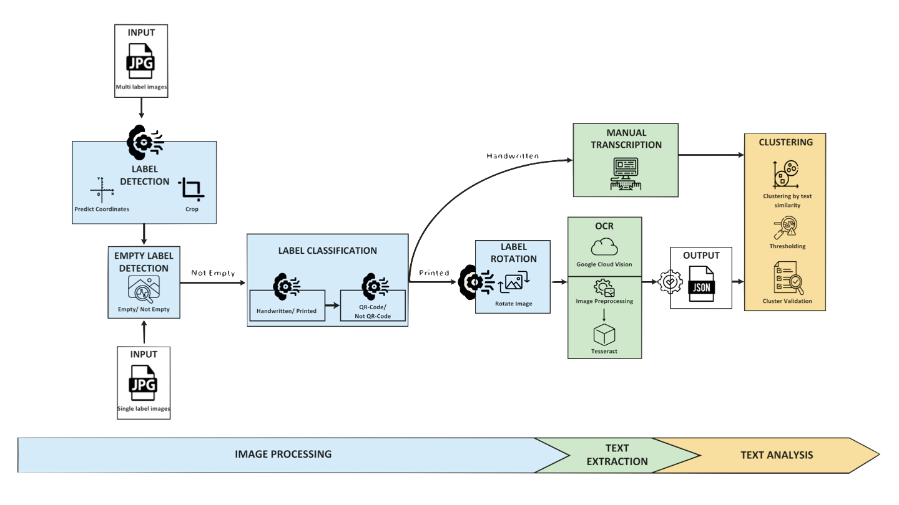

==============================================================
Collection Mining – Entomological Label Information Extraction
==============================================================

.. image:: https://img.shields.io/badge/python-3.9%2B-blue.svg
   :alt: Python Version
   :target: https://python.org

.. image:: https://img.shields.io/badge/license-GPL--3.0-green.svg
   :alt: License
   :target: LICENSE

.. contents::
   :local:
   :depth: 2

Overview
========

This package provides a **modular AI framework** for the semi-automated processing of entomological specimen labels. 
It combines state-of-the-art machine learning techniques to create a complete digitization pipeline that transforms 
physical specimen labels into structured, searchable data.

**Pipeline Workflow:**

**Legend:**

- **🔍 Detection Stage**: Automatically locate and extract individual labels from specimen images
- **🏷️ Classification Stage**: Categorize labels by characteristics (handwritten vs. printed, etc.)
- **🔄 Rotation Stage**: Correct text orientation for optimal OCR performance
- **📝 OCR Stage**: Extract text using Tesseract or Google Cloud Vision API
- **⚙️ Post-processing**: Clean, structure, and validate extracted information
- **📊 Output**: Generate CSV, JSON, and structured data files

**Process Flow:**

1. **Label Detection** → Automatically locate labels in specimen images
2. **Image Classification** → Categorize labels by type (handwritten, printed, etc.)
3. **Rotation Correction** → Align text for optimal OCR performance  
4. **Text Extraction** → Convert images to text using OCR technologies
5. **Post-processing** → Clean and structure extracted information

Key Features
============

🤖 **AI-Powered Processing**
  - Three specialized TensorFlow classifiers for different label types
  - Deep learning models for label detection and rotation correction
  - Optimized for entomological specimen workflows

📝 **Flexible OCR Pipeline**
  - **Tesseract OCR**: Free, offline text recognition
  - **Google Cloud Vision API**: Premium cloud-based OCR with superior accuracy
  - QR code detection and processing capabilities

🔧 **Modular Architecture**
  - Independent components for each processing stage
  - Docker containerization for easy deployment
  - Configurable pipelines for different use cases

⚡ **Production Ready**
  - Optimized for large-scale collections (thousands of specimens)
  - GPU acceleration support for faster inference
  - Comprehensive error handling and logging

📚 **Extensible & Reproducible**
  - Jupyter notebooks for model retraining on custom datasets
  - Well-documented APIs for integration with existing workflows
  - Complete unit test coverage

Datasets
========

The training and testing datasets used for model development are publicly available on Zenodo:  
`https://doi.org/10.7479/khac-x956 <https://doi.org/10.7479/khac-x956>`_

Quick Start
===========

**For Docker users (recommended):**

.. code-block:: console

   # Clone the repository
   git clone <repository-url>
   cd entomological-label-information-extraction
   
   # Place your images in data/MLI/input/
   # Run the complete pipeline
   docker compose -f multi-label-docker-compose.yaml up --build
   
   # Results will be in data/MLI/output/

**For Python developers:**

.. code-block:: console

   # Install the package
   pip install -e .
   
   # Run individual components
   python scripts/processing/detection.py --input /path/to/images

Prerequisites
=============

**System Requirements:**

- **Python**: 3.9+ (3.10 recommended for optimal compatibility)
- **Docker**: Desktop version with Docker Compose
- **Memory**: 8GB+ RAM recommended (16GB+ for large datasets)
- **Storage**: 2GB+ free space for models and temporary files

**Optional Components:**

- **Conda**: For isolated environment management
- **NVIDIA GPU**: For accelerated inference (10x+ speed improvement)
- **Google Cloud Account**: For premium OCR capabilities

Installation
============

1. Create a Python 3.10 environment (recommended to ensure dependency compatibility):

   .. code-block:: console

      conda create --name ELIE python=3.10

2. Activate the environment:

   .. code-block:: console

      conda activate ELIE

3. Install the package:

   .. code-block:: console

      cd entomological-label-information-extraction
      pip install .

4. Install Tesseract OCR (optional, required if using Tesseract):

   - **Ubuntu/Debian**:

     .. code-block:: console

        sudo apt install tesseract-ocr

   - **macOS**:

     .. code-block:: console

        brew install tesseract

Input Image Guidelines
======================

The modules work best on **JPEG** images that adhere to standardized practices, such as those from:

- `AntWeb <https://www.antweb.org/>`_
- `Bees & Bytes <https://www.zooniverse.org/projects/mfnberlin/bees-and-bytes>`_
- `Atlas of Living Australia <https://www.ala.org.au/>`_

Recommended image specifications:

- High-resolution JPEG format (300 DPI)
- Clear separation between labels
- Horizontal text alignment
- No insects or other elements in the image
- Consistent label positioning across images
- Preferably black background (white is acceptable)

Google Cloud Vision Setup
=========================

To use the Google Vision API:

1. Create a Google Cloud account.
2. Follow the setup instructions here:  
   `Google Vision API setup <https://cloud.google.com/vision/docs/setup>`_
3. Generate and download a **credentials JSON** file.

Run the OCR script independently:

.. code-block:: console

   python scripts/processing/vision.py -d <path_to_cropped_images> -c <path_to_credentials.json> -o <output_directory>

Replace placeholders with your actual paths.

Installing `zbar` for QR Code Recognition
=========================================

To enhance QR code detection using `zbar`, install the following dependencies:

- **macOS**:

  .. code-block:: console

     brew install zbar

- **Linux**:

  .. code-block:: console

     sudo apt-get install libzbar0

- **Windows**: `zbar` is bundled with the Python wheels and requires no extra setup.

Docker Usage
============

Docker Installation
-------------------

Download and install Docker Desktop:

- https://www.docker.com/products/docker-desktop/

Verify Docker is installed:

.. code-block:: console

   docker --version

Docker Compose Installation
---------------------------

(Optional) Install Docker Compose via conda:

.. code-block:: console

   conda install -c conda-forge docker-compose

Verify Docker Compose:

.. code-block:: console

   docker-compose --version

Pipeline Execution
------------------

This repository includes Dockerfiles and Docker Compose configurations.

**Available Compose Modes**:

- **Multi-label**: Full pipeline including label detection.
- **Single-label**: Pipeline without detection (e.g., cropped labels).

.. note::

   Example datasets for both pipelines are available in the ``data/`` folder.

**Run Multi-label Pipeline** (recommended):

.. code-block:: console

   docker compose -f multi-label-docker-compose.yaml up --build

This will:

1. Build all Docker images
2. Run detection, classification, OCR, and postprocessing

**Run Single-label Pipeline**:

.. code-block:: console

   docker compose -f single-label-docker-compose.yaml up --build

Final output will be saved in:

- ``data/MLI/`` for multi-label
- ``data/SLI/`` for single-label

To stop the pipeline at any time:

.. code-block:: console

   Ctrl+C

Troubleshooting
---------------

- **Docker must be running**: Ensure Docker Desktop is active.
- **Out-of-memory errors**: Increase memory allocation in Docker Desktop → Settings → Resources → Memory (8GB+ recommended).
- **Missing files**: Ensure images are placed in the correct ``data/`` subfolders.
- **Build changes**: Use ``--build`` when modifying Dockerfiles.
- **Missing libraries**: Ensure required dependencies (e.g., ``cv2``, ``libGL.so.1``) are installed.
- **Orphan containers**:

  .. code-block:: console

     docker compose -f multi-label-docker-compose.yaml down --remove-orphans

Hardware Requirements
=====================

- Recommended: **NVIDIA GPU** for fast inference
- CPU-only systems are supported but significantly slower
- To enable GPU support in Docker:

  1. Install the `NVIDIA Container Toolkit <https://docs.nvidia.com/datacenter/cloud-native/container-toolkit/install-guide.html>`_
  2. Run Docker with GPU support:

     .. code-block:: console

        docker compose --gpus all -f multi-label-docker-compose.yaml up --build

Usage Examples
==============

**Processing Individual Components:**

.. code-block:: python

   from label_processing.label_detection import PredictLabel
   from label_processing.tensorflow_classifier import class_prediction
   from label_processing.text_recognition import ImageProcessor, Tesseract
   
   # Label detection
   detector = PredictLabel(model_path, ["label"], image_path)
   predictions = detector.class_prediction(image_path)
   
   # Classification
   model = get_model(classifier_path)
   df = class_prediction(model, ["handwritten", "printed"], image_dir)
   
   # OCR processing
   processor = ImageProcessor.read_image(image_path)
   ocr = Tesseract(image=processor)
   text_result = ocr.image_to_string()

**Command Line Usage:**

.. code-block:: console

   # Run label detection
   python scripts/processing/detection.py \
     --input data/input/ \
     --output data/detection/ \
     --model models/label_detection_model.pth
   
   # Run classification
   python scripts/processing/classifiers.py \
     --input data/detection/ \
     --output data/classified/ \
     --model models/label_classifier_hp/
   
   # Run OCR with Tesseract
   python scripts/processing/tesseract.py \
     --input data/classified/ \
     --output data/ocr_results/

Output Format
=============

The pipeline generates structured output in multiple formats:

**CSV Files:**
  - ``detection_results.csv``: Bounding boxes and confidence scores
  - ``classification_results.csv``: Label types and predictions
  - ``ocr_results.csv``: Extracted text with confidence metrics

**JSON Files:**
  - ``processed_labels.json``: Complete structured data for each label
  - ``pipeline_metadata.json``: Processing parameters and statistics

**Example Output Structure:**

.. code-block:: json

   {
     "filename": "specimen_001.jpg",
     "labels": [
       {
         "bbox": [100, 150, 300, 250],
         "classification": "printed",
         "confidence": 0.95,
         "text": "Lepidoptera\nNoctuidae\nCollected: 1995-07-15",
         "qr_code": null,
         "processed_text": {
           "family": "Noctuidae",
           "order": "Lepidoptera",
           "collection_date": "1995-07-15"
         }
       }
     ]
   }

Development & Testing
====================

**Running Tests:**

.. code-block:: console

   # Run all tests
   python -m unittest discover unit_tests
   
   # Run with coverage
   pip install pytest pytest-cov
   pytest unit_tests/ --cov=. --cov-report=html
   
   # Run specific test modules
   python -m unittest unit_tests.label_processing_tests.test_detection

**Code Quality:**

.. code-block:: console

   # Install development dependencies
   pip install -e .[dev]
   
   # Run code formatting
   black .
   isort .
   
   # Run linting
   flake8 .
   mypy .
   
   # Set up pre-commit hooks
   pre-commit install

Model Retraining
===============

Customize the models for your specific datasets using the provided Jupyter notebooks:

**Available Training Notebooks:**

- ``training_notebooks/Label_Detection_Detecto_Training_Notebook.ipynb``
  - Retrain the label detection model on custom specimen images
  - Supports custom annotation formats and label types

- ``training_notebooks/Classifier_TensorFlow_Training_Notebook.ipynb``
  - Train classification models for different label characteristics
  - Includes data augmentation and transfer learning techniques

- ``training_notebooks/Label_Rotation_TensorFlow_Training_Notebook.ipynb``
  - Develop rotation correction models for your image types
  - Handles various rotation angles and image qualities

**Training Data Requirements:**

- **Detection**: Annotated images with bounding box coordinates
- **Classification**: Labeled image crops organized by category
- **Rotation**: Image pairs (original and corrected orientations)

License
=======

This project is licensed under the GPL-3.0 License - see the `LICENSE <LICENSE>`_ file for details.

Citation
========

If you use this software in your research, please cite the associated dataset:

.. code-block:: bibtex

   @dataset{entomological_labels_2024,
     title={Entomological Label Information Extraction Dataset},
     url={https://doi.org/10.7479/khac-x956},
     DOI={10.7479/khac-x956},
     publisher={Zenodo},
     year={2024}
   }
