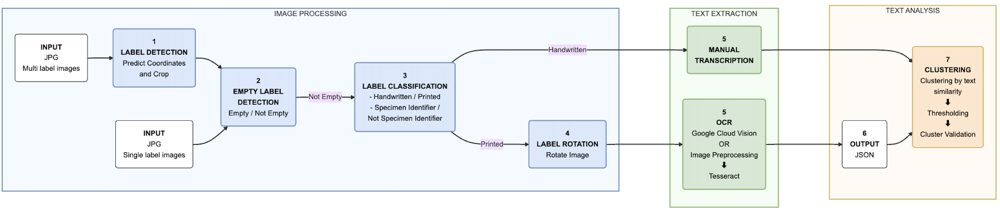

Entomological Label Information Extraction
==========================================

**AI-powered text extraction from insect specimen labels** 🦋

Extract and digitize text from museum specimen labels automatically using computer vision and OCR. Perfect for museum digitization, research data preparation, and biodiversity informatics.

.. note::
   💡 **New to the project?** Start with the :doc:`quickstart` guide for a 5-minute setup!

Quick Navigation
----------------

.. grid:: 2 2 2 2
   :gutter: 3

   .. grid-item-card:: 🚀 Get Started
      :link: quickstart
      :link-type: doc

      5-minute setup guide
      ^^^^^^^^^^^^^^^^^^^^
      Install, configure, and run your first processing job.

   .. grid-item-card:: 📖 User Guide
      :link: user_guide
      :link-type: doc

      Complete documentation
      ^^^^^^^^^^^^^^^^^^^^^^
      Learn all features and workflows in detail.

   .. grid-item-card:: ⚙️ Installation
      :link: installation
      :link-type: doc

      Setup instructions
      ^^^^^^^^^^^^^^^^^^
      Step-by-step installation for all platforms.

   .. grid-item-card:: 🔧 API Reference
      :link: api/modules
      :link-type: doc

      Technical docs
      ^^^^^^^^^^^^^^
      Complete API documentation for developers.

Main Documentation
------------------

.. toctree::
   :maxdepth: 2
   :caption: 📚 Getting Started
   :hidden:
   
   installation
   quickstart
   user_guide

.. toctree::
   :maxdepth: 2
   :caption: 🔧 API Reference
   :hidden:
   
   api/modules

.. toctree::
   :maxdepth: 1
   :caption: 🛠️ Help & Info
   :hidden:
   
   troubleshooting
   ADVANCED_CONFIG
   ROTATION_MODEL_SETUP
   contributing
   changelog
   license

Key Features
------------

✨ **What makes this special:**

- **Gemini Pipeline** *(recommended)*: Cloud-based detection, classification, OCR, and handwritten text via Google Gemini API
- **Smart Detection**: Automatically finds labels in specimen photos
- **AI Classification**: Distinguishes handwritten, printed, and empty labels
- **Triple OCR Support**: Gemini API (recommended), Tesseract (free/offline), or Google Vision
- **Entity Recognition**: Extracts structured entities (species, collectors, dates, localities) with GBIF validation and OSM geocoding
- **Darwin Core Export**: Outputs standardised Darwin Core records (JSON and CSV)
- **Easy to Use**: Streamlit web interface + command line + Docker options
- **Museum Ready**: Designed specifically for scientific specimens
- **Open Source**: MIT license, fully extensible

Supported Workflows
-------------------

**Option 1: Gemini Pipeline (Recommended)** 🚀
   Specimen photos or pre-cropped labels → Gemini detection + classification + OCR/HTR → Entity recognition → GBIF/OSM enrichment → Darwin Core export

**Option 2: Multi-Label Images (MLI)** 📷
   Full specimen photos → Detect labels (Detectron2) → Crop → Classify → Tesseract OCR → Structured output

**Option 3: Single-Label Images (SLI)** 🏷️
   Pre-cropped labels → Classify → OCR → Clean text → Structured output

Performance Stats
-----------------

.. list-table::
   :header-rows: 1
   :class: rtd-table

   * - Metric
     - Performance
   * - Detection Accuracy
     - 90%+ F1-score
   * - Classification Accuracy
     - 95%+ overall
   * - OCR Character Error Rate
     - <5% on quality images
   * - Processing Speed
     - 100+ images/hour

Need Help?
----------

🆘 **Common starting points:**

- **Installation issues?** → :doc:`troubleshooting`
- **Want to contribute?** → :doc:`contributing`
- **Need API docs?** → :doc:`api/modules`
- **Detailed usage?** → :doc:`user_guide`

**Indices and Search**
======================

* :ref:`genindex`
* :ref:`modindex`
* :ref:`search`
